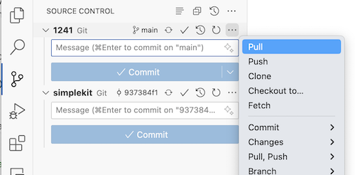
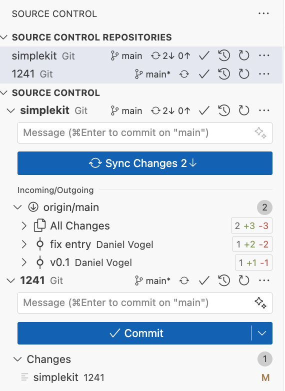

# CS349 F24 Demo Code

Code relating to lecture slides and in-class demos.

Most folders correspond with a set of slides posted on the course website. For example, code for the "Drawing" lecture is in the `drawing/` demo folder. Lecture demo slides will reference specific "sets" of demos, for example the "Drawing" lecture has demo slides with "drawable" in the title, these correspond to `drawing/src/drawable`. In some cases a specific function will be noted in the demo slides as well.

Demo code will be posted (or updated) shortly before each lecture.

### SimpleKit

This is a simple imperative-style toolkit that runs in the browser. We use it to show examples of UI toolkit architecture and it's used in the first two assignments.

See lecture demos for examples how to use SimpleKit, and see assignment write-ups for details how to setup SimpleKit for assignments.

## Setup

After you clone this repo, you'll have to do a bit more setup to run the demos.

1. Run `npm install` in the lecture demo folder you want to run (e.g. in `drawing/`). This installs Vite and other packages needed for that set of demos.

2. For demos requiring SimpleKit, you'll need to do a bit more setup to make the SimpleKit git "submodule" work.

   - Open a terminal and cd to the simplekit folder in the root of this repo (since it's a submodule, it initially appears empty)
   - Initialize the git submodule using terminal command: `git submodule init`
   - Perform the first update of the git submodule using: `git submodule update`
   - Now the simplekit folder will be populated to match the simplekit repo on GitHub, and you'll see the simplekit repo listed in the VS Code source control tab

## Keeping Up to Date

During the term frequently "pull" the latest code from the public code repo. Since there's a submodule, there's some extra setup or extra steps depending whether you pull using the command line or in VS Code.

### 🥇 (RECOMMENDED METHOD) Git in the Terminal

_The easiest and most foolproof way to pull a repo with submodules is using git in the terminal._

First, there's a one time setup for your system to add a "pullall" command to your git config. Execute this in your terminal:

```sh
git config --global alias.pullall '!git pull && git submodule update --init --recursive'
```

Now, you can pull the main repo and the simplekit submodule easily with one git command in the terminal:

```sh
git pullall
```

Read this [Git documentation page](https://git-scm.com/book/en/v2/Git-Tools-Submodules) and this [StackOverflow post](https://stackoverflow.com/questions/4611512/is-there-a-way-to-make-git-pull-automatically-update-submodules) for more background.

### ⚠️ (ALTERNATE METHOD) VS Code Git Interface

_This can be a multi-step process, if you don't pay attention to the order, or forget a step when the submodule link was updated in remote, you may put your repo clone in an unexpected state._

1. Use the "Pull" command in the VS Code "Source Control" tab interface to pull the latest version from the _main public repo_. See the screencap below. **DO NOT PULL the simplekit submodule in this step!**

   

2a. _If the public repo didn't update the simplekit submodule "link",_ you won't see any changes listed in the git tab. You're done.

2b. _If the public repo did update the simplekit submodule "link"_, you'll see a "Change" for the "simplekit" submodule file after pulling. **DO NOT commit that change!.**

   

3. _Look at the git info for the simplekit submodule._ It'll list 1 or more changes to be synced (like in screencap above). Click on "Sync Changes" button for simplekit, and the changed "simplekit" submodule file in the main repo will disappear. Now the simplekit submodule is up-to-date and synchronized correctly with your public repo clone.

> **🔥 Always pull from the cs349 public repo first. 🔥**

> **Avoid using VS Code git Autofetch for the SimpleKit submodule.** It will "fetch" changes as suggest updating even if the main demo code repo is using a different version of SimpleKit. Only pull SimpleKit when the main repo updates the version.

-
